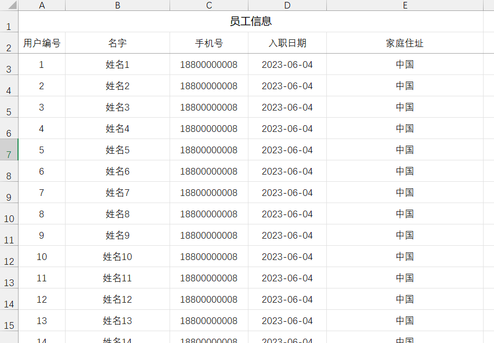
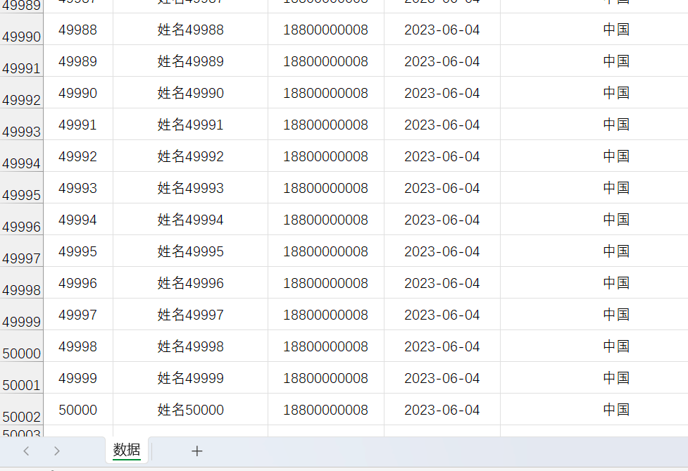
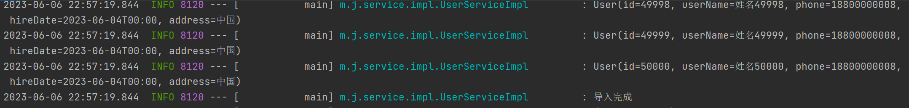

# easyPOI

## 概述

以上在导出导出excel、导出csv、word时代码有点过于繁琐，好消息是近两年在开发市场上流行一种简化POI开发的类库：easyPOI。从名称上就能发现就是为了简化开发。

Excel的快速导入导出、Excel模板导出、Word模板导出，可以仅仅5行代码就可以完成Excel的导入导出，修改导出格式简单粗暴，快速有效


Easypoi的目标不是替代poi,而是让一个不懂导入导出的快速使用poi完成Excel和word的各种操作,而不是看很多api才可以完成这样工作


## 依赖

```xml
<dependency>
    <groupId>cn.afterturn</groupId>
    <artifactId>easypoi-base</artifactId>
    <version>4.4.0</version>
</dependency>
<dependency>
    <groupId>cn.afterturn</groupId>
    <artifactId>easypoi-web</artifactId>
    <version>4.4.0</version>
</dependency>
<dependency>
    <groupId>cn.afterturn</groupId>
    <artifactId>easypoi-annotation</artifactId>
    <version>4.4.0</version>
</dependency>
```


spring boot 依赖：

```xml
<dependency>
    <groupId>cn.afterturn</groupId>
    <artifactId>easypoi-spring-boot-starter</artifactId>
    <version>4.4.0</version>
</dependency>
```


## 注解方式导出

主要用到的注解是@Excel注解，注解的属性说明如下：

|      属性      |   类型   |       类型       |                             说明                             |
| :------------: | :------: | :--------------: | :----------------------------------------------------------: |
|      name      |  String  |       null       |                             列名                             |
|   needMerge    | boolean  |      fasle       |                        纵向合并单元格                        |
|    orderNum    |  String  |       "0"        |                     列的排序,支持name_id                     |
|    replace     | String[] |        {}        |            值得替换  导出是{a_id,b_id} 导入反过来            |
|    savePath    |  String  |     "upload"     |                       导入文件保存路径                       |
|      type      |   int    |        1         |   导出类型 1 是文本 2 是图片,3 是函数,10 是数字 默认是文本   |
|     width      |  double  |        10        |                             列宽                             |
|     height     |  double  |        10        | 列高,后期打算统一使用@ExcelTarget的height,这个会被废弃,注意  |
|  isStatistics  | boolean  |      fasle       | 自动统计数据,在追加一行统计,把所有数据都和输出这个处理会吞没异常,请注意这一点 |
|  isHyperlink   | boolean  |      false       |              超链接,如果是需要实现接口返回对象               |
| isImportField  | boolean  |       true       | 校验字段,看看这个字段是不是导入的Excel中有,如果没有说明是错误的Excel,读取失败,支持name_id |
|  exportFormat  |  String  |        ""        |    导出的时间格式,以这个是否为空来判断是否需要格式化日期     |
|  importFormat  |  String  |        ""        |    导入的时间格式,以这个是否为空来判断是否需要格式化日期     |
|     format     |  String  |        ""        |    时间格式,相当于同时设置了exportFormat 和 importFormat     |
| databaseFormat |  String  | "yyyyMMddHHmmss" | 导出时间设置,如果字段是Date类型则不需要设置 数据库如果是string类型,这个需要设置这个数据库格式,用以转换时间格式输出 |
|   numFormat    |  String  |        ""        |      数字格式化,参数是Pattern,使用的对象是DecimalFormat      |
|   imageType    |   int    |        1         | 导出类型 1 从file读取 2 是从数据库中读取 默认是文件 同样导入也是一样的 |
|     suffix     |  String  |        ""        |                   文字后缀,如% 90 变成90%                    |
|     isWrap     | boolean  |       true       |                      是否换行 即支持\n                       |
|   mergeRely    |  int[]   |        {}        | 合并单元格依赖关系,比如第二列合并是基于第一列 则{1}就可以了  |
| mergeVertical  | boolean  |      fasle       |                   纵向合并内容相同的单元格                   |


创建spring boot程序，依赖如下：

```xml
<dependencies>
        <dependency>
            <groupId>org.springframework.boot</groupId>
            <artifactId>spring-boot-starter</artifactId>
        </dependency>

        <dependency>
            <groupId>org.projectlombok</groupId>
            <artifactId>lombok</artifactId>
            <optional>true</optional>
        </dependency>

        <dependency>
            <groupId>org.springframework.boot</groupId>
            <artifactId>spring-boot-starter-test</artifactId>
            <scope>test</scope>
        </dependency>

        <!--easypoi spring boot 依赖 需要web环境-->
        <!--<dependency>
            <groupId>cn.afterturn</groupId>
            <artifactId>easypoi-spring-boot-starter</artifactId>
            <version>4.4.0</version>
        </dependency>-->


        <!--easypoi 依赖-->
        <dependency>
            <groupId>cn.afterturn</groupId>
            <artifactId>easypoi-base</artifactId>
            <version>4.4.0</version>
        </dependency>
        <dependency>
            <groupId>cn.afterturn</groupId>
            <artifactId>easypoi-web</artifactId>
            <version>4.4.0</version>
        </dependency>
        <dependency>
            <groupId>cn.afterturn</groupId>
            <artifactId>easypoi-annotation</artifactId>
            <version>4.4.0</version>
        </dependency>

        <!--spring-boot mybatis-plus依赖-->
        <dependency>
            <groupId>com.baomidou</groupId>
            <artifactId>mybatis-plus-boot-starter</artifactId>
            <version>3.5.1</version>
        </dependency>

        <!--spring-boot druid连接池依赖-->
        <dependency>
            <groupId>com.alibaba</groupId>
            <artifactId>druid-spring-boot-starter</artifactId>
            <version>1.2.8</version>
        </dependency>

        <!--mysql依赖 spring-boot-->
        <dependency>
            <groupId>mysql</groupId>
            <artifactId>mysql-connector-java</artifactId>
            <scope>runtime</scope>
        </dependency>

    </dependencies>
```


用户实体类：

```java
package mao.java_report_easypoi_import_and_export_excel.entity;

import cn.afterturn.easypoi.excel.annotation.Excel;
import com.baomidou.mybatisplus.annotation.TableField;
import com.baomidou.mybatisplus.annotation.TableId;
import lombok.Data;

import java.time.LocalDateTime;

/**
 * Project name(项目名称)：java_report_poi_million_data_export
 * Package(包名): mao.java_report_poi_million_data_export.entity
 * Class(类名): User
 * Author(作者）: mao
 * Author QQ：1296193245
 * GitHub：https://github.com/maomao124/
 * Date(创建日期)： 2023/6/5
 * Time(创建时间)： 13:42
 * Version(版本): 1.0
 * Description(描述)： 无
 */


@Data
public class User
{
    @TableId
    @Excel(name = "用户编号", orderNum = "0", width = 9, type = 10)
    private Long id;

    @TableField(value = "user_name")
    @Excel(name = "名字", orderNum = "1", width = 20, type = 1)
    private String userName;

    @Excel(name = "手机号", orderNum = "2", width = 15, type = 10)
    private String phone;

    @Excel(name = "入职日期", format = "yyyy-MM-dd", orderNum = "3", width = 15)
    private LocalDateTime hireDate;

    @Excel(name = "家庭住址", orderNum = "4", width = 30, type = 1)
    private String address;
}
```


```java
package mao.java_report_easypoi_import_and_export_excel.service;

import com.baomidou.mybatisplus.extension.service.IService;
import mao.java_report_easypoi_import_and_export_excel.entity.User;

/**
 * Project name(项目名称)：java_report_easypoi_import_and_export_excel
 * Package(包名): mao.java_report_easypoi_import_and_export_excel.service
 * Interface(接口名): UserService
 * Author(作者）: mao
 * Author QQ：1296193245
 * GitHub：https://github.com/maomao124/
 * Date(创建日期)： 2023/6/6
 * Time(创建时间)： 22:30
 * Version(版本): 1.0
 * Description(描述)： 无
 */

public interface UserService extends IService<User>
{
    /**
     * 下载excel
     */
    void download();
}
```


```java
package mao.java_report_easypoi_import_and_export_excel.service.impl;

import cn.afterturn.easypoi.excel.ExcelExportUtil;
import cn.afterturn.easypoi.excel.entity.ExportParams;
import cn.afterturn.easypoi.excel.entity.enmus.ExcelType;
import com.baomidou.mybatisplus.core.metadata.IPage;
import com.baomidou.mybatisplus.extension.plugins.pagination.Page;
import com.baomidou.mybatisplus.extension.service.impl.ServiceImpl;
import lombok.extern.slf4j.Slf4j;
import mao.java_report_easypoi_import_and_export_excel.entity.User;
import mao.java_report_easypoi_import_and_export_excel.mapper.UserMapper;
import mao.java_report_easypoi_import_and_export_excel.service.UserService;
import org.apache.poi.ss.usermodel.Workbook;
import org.springframework.stereotype.Service;

import java.io.FileOutputStream;
import java.util.List;

/**
 * Project name(项目名称)：java_report_easypoi_import_and_export_excel
 * Package(包名): mao.java_report_easypoi_import_and_export_excel.service.impl
 * Class(类名): UserServiceImpl
 * Author(作者）: mao
 * Author QQ：1296193245
 * GitHub：https://github.com/maomao124/
 * Date(创建日期)： 2023/6/6
 * Time(创建时间)： 22:30
 * Version(版本): 1.0
 * Description(描述)： 无
 */

@Slf4j
@Service
public class UserServiceImpl extends ServiceImpl<UserMapper, User> implements UserService
{

    @Override
    public void download()
    {
        log.info("开始导出");
        //只导出前5万条
        IPage<User> page = new Page<>(0, 50000);
        List<User> userList = this.page(page).getRecords();
        //指定导出的格式是高版本的格式
        ExportParams exportParams = new ExportParams("员工信息", "数据", ExcelType.XSSF);
        //直接使用EasyPOI提供的方法
        Workbook workbook = ExcelExportUtil.exportExcel(exportParams, User.class, userList);
        try (FileOutputStream fileOutputStream = new FileOutputStream("./out.xlsx"))
        {
            workbook.write(fileOutputStream);
            workbook.close();
            log.info("导出完成");
        }
        catch (Exception e)
        {
            e.printStackTrace();
        }
    }
}
```


启动类：

```java
package mao.java_report_easypoi_import_and_export_excel;

import mao.java_report_easypoi_import_and_export_excel.service.UserService;
import org.springframework.boot.SpringApplication;
import org.springframework.boot.autoconfigure.SpringBootApplication;
import org.springframework.context.ConfigurableApplicationContext;

@SpringBootApplication
public class JavaReportEasypoiImportAndExportExcelApplication
{

    public static void main(String[] args)
    {
        ConfigurableApplicationContext context = SpringApplication.run(JavaReportEasypoiImportAndExportExcelApplication.class, args);
        UserService userService = context.getBean(UserService.class);
        userService.download();
    }

}
```


运行：

```sh
  .   ____          _            __ _ _
 /\\ / ___'_ __ _ _(_)_ __  __ _ \ \ \ \
( ( )\___ | '_ | '_| | '_ \/ _` | \ \ \ \
 \\/  ___)| |_)| | | | | || (_| |  ) ) ) )
  '  |____| .__|_| |_|_| |_\__, | / / / /
 =========|_|==============|___/=/_/_/_/
 :: Spring Boot ::                (v2.7.1)

          _____                    _____                   _______
         /\    \                  /\    \                 /::\    \
        /::\____\                /::\    \               /::::\    \
       /::::|   |               /::::\    \             /::::::\    \
      /:::::|   |              /::::::\    \           /::::::::\    \
     /::::::|   |             /:::/\:::\    \         /:::/~~\:::\    \
    /:::/|::|   |            /:::/__\:::\    \       /:::/    \:::\    \
   /:::/ |::|   |           /::::\   \:::\    \     /:::/    / \:::\    \
  /:::/  |::|___|______    /::::::\   \:::\    \   /:::/____/   \:::\____\
 /:::/   |::::::::\    \  /:::/\:::\   \:::\    \ |:::|    |     |:::|    |
/:::/    |:::::::::\____\/:::/  \:::\   \:::\____\|:::|____|     |:::|    |
\::/    / ~~~~~/:::/    /\::/    \:::\  /:::/    / \:::\    \   /:::/    /
 \/____/      /:::/    /  \/____/ \:::\/:::/    /   \:::\    \ /:::/    /
             /:::/    /            \::::::/    /     \:::\    /:::/    /
            /:::/    /              \::::/    /       \:::\__/:::/    /
           /:::/    /               /:::/    /         \::::::::/    /
          /:::/    /               /:::/    /           \::::::/    /
         /:::/    /               /:::/    /             \::::/    /
        /:::/    /               /:::/    /               \::/____/
        \::/    /                \::/    /                 ~~
         \/____/                  \/____/
 :: Github (https://github.com/maomao124) ::

2023-06-06 22:46:27.380  INFO 8368 --- [           main] rtEasypoiImportAndExportExcelApplication : Starting JavaReportEasypoiImportAndExportExcelApplication using Java 1.8.0_332 on mao with PID 8368 (D:\程序\大四下期\java_report_easypoi_import_and_export_excel\target\classes started by mao in D:\程序\大四下期\java_report_easypoi_import_and_export_excel)
2023-06-06 22:46:27.381 DEBUG 8368 --- [           main] rtEasypoiImportAndExportExcelApplication : Running with Spring Boot v2.7.1, Spring v5.3.21
2023-06-06 22:46:27.381  INFO 8368 --- [           main] rtEasypoiImportAndExportExcelApplication : No active profile set, falling back to 1 default profile: "default"
2023-06-06 22:46:27.714  INFO 8368 --- [           main] c.a.d.s.b.a.DruidDataSourceAutoConfigure : Init DruidDataSource
2023-06-06 22:46:27.758  INFO 8368 --- [           main] com.alibaba.druid.pool.DruidDataSource   : {dataSource-1} inited
 _ _   |_  _ _|_. ___ _ |    _ 
| | |\/|_)(_| | |_\  |_)||_|_\ 
     /               |         
                        3.5.1 
2023-06-06 22:46:28.241  INFO 8368 --- [           main] rtEasypoiImportAndExportExcelApplication : Started JavaReportEasypoiImportAndExportExcelApplication in 1.035 seconds (JVM running for 1.474)
2023-06-06 22:46:28.248  INFO 8368 --- [           main] m.j.service.impl.UserServiceImpl         : 开始导出
2023-06-06 22:46:28.441 DEBUG 8368 --- [           main] m.j.m.UserMapper.selectPage_mpCount      : ==>  Preparing: SELECT COUNT(*) AS total FROM user
2023-06-06 22:46:28.450 DEBUG 8368 --- [           main] m.j.m.UserMapper.selectPage_mpCount      : ==> Parameters: 
2023-06-06 22:46:30.405 DEBUG 8368 --- [           main] m.j.m.UserMapper.selectPage_mpCount      : <==      Total: 1
2023-06-06 22:46:30.408 DEBUG 8368 --- [           main] m.j.mapper.UserMapper.selectPage         : ==>  Preparing: SELECT id,user_name,phone,hire_date,address FROM user LIMIT ?
2023-06-06 22:46:30.408 DEBUG 8368 --- [           main] m.j.mapper.UserMapper.selectPage         : ==> Parameters: 50000(Long)
2023-06-06 22:46:30.624 DEBUG 8368 --- [           main] m.j.mapper.UserMapper.selectPage         : <==      Total: 50000
2023-06-06 22:46:33.272  INFO 8368 --- [           main] m.j.service.impl.UserServiceImpl         : 导出完成
2023-06-06 22:46:33.274  INFO 8368 --- [ionShutdownHook] com.alibaba.druid.pool.DruidDataSource   : {dataSource-1} closing ...
2023-06-06 22:46:33.276  INFO 8368 --- [ionShutdownHook] com.alibaba.druid.pool.DruidDataSource   : {dataSource-1} closed
```








## 注解方式导入

Excel导入时需要的参数类ImportParams常用设置说明

1. 读取指定的sheet 比如要读取上传得第二个sheet 那么需要把startSheetIndex = 1 就可以了

2. 读取几个sheet  比如读取前2个sheet,那么 sheetNum=2 就可以了
3. 读取第二个到第五个sheet 设置 startSheetIndex = 1 然后sheetNum = 4
4. 读取全部的sheet sheetNum  设置大点就可以了
5. 保存Excel 设置 needVerfiy = true,默认保存的路径为upload/excelUpload/Test/yyyyMMddHHmss 保存名称上传时间五位随机数 如果自定义路径 修改下saveUrl 就可以了,同时saveUrl也是图片上传时候的保存的路径
6. 判断一个Excel是不是合法的Excel  importFields 设置下值,就是表示表头必须至少包含的字段,如果缺一个就是不合法的excel,不导入
7. 图片的导入

有图片的导出就有图片的导入,导入的配置和导出是一样的,但是需要设置保存路径 1.设置保存路径saveUrl 默认为"upload/excelUpload" 可以手动修改 ImportParams 修改下就可以了


```java
package mao.java_report_easypoi_import_and_export_excel.service;

import com.baomidou.mybatisplus.extension.service.IService;
import mao.java_report_easypoi_import_and_export_excel.entity.User;

/**
 * Project name(项目名称)：java_report_easypoi_import_and_export_excel
 * Package(包名): mao.java_report_easypoi_import_and_export_excel.service
 * Interface(接口名): UserService
 * Author(作者）: mao
 * Author QQ：1296193245
 * GitHub：https://github.com/maomao124/
 * Date(创建日期)： 2023/6/6
 * Time(创建时间)： 22:30
 * Version(版本): 1.0
 * Description(描述)： 无
 */

public interface UserService extends IService<User>
{
    /**
     * 下载excel
     */
    void download();

    /**
     * 导入excel
     */
    void importExcel();
}
```


```java
package mao.java_report_easypoi_import_and_export_excel.service.impl;

import cn.afterturn.easypoi.excel.ExcelExportUtil;
import cn.afterturn.easypoi.excel.ExcelImportUtil;
import cn.afterturn.easypoi.excel.entity.ExportParams;
import cn.afterturn.easypoi.excel.entity.ImportParams;
import cn.afterturn.easypoi.excel.entity.enmus.ExcelType;
import com.baomidou.mybatisplus.core.metadata.IPage;
import com.baomidou.mybatisplus.extension.plugins.pagination.Page;
import com.baomidou.mybatisplus.extension.service.impl.ServiceImpl;
import lombok.extern.slf4j.Slf4j;
import mao.java_report_easypoi_import_and_export_excel.entity.User;
import mao.java_report_easypoi_import_and_export_excel.mapper.UserMapper;
import mao.java_report_easypoi_import_and_export_excel.service.UserService;
import org.apache.poi.ss.usermodel.Workbook;
import org.springframework.stereotype.Service;

import java.io.FileInputStream;
import java.io.FileOutputStream;
import java.util.List;
import java.util.function.Consumer;

/**
 * Project name(项目名称)：java_report_easypoi_import_and_export_excel
 * Package(包名): mao.java_report_easypoi_import_and_export_excel.service.impl
 * Class(类名): UserServiceImpl
 * Author(作者）: mao
 * Author QQ：1296193245
 * GitHub：https://github.com/maomao124/
 * Date(创建日期)： 2023/6/6
 * Time(创建时间)： 22:30
 * Version(版本): 1.0
 * Description(描述)： 无
 */

@Slf4j
@Service
public class UserServiceImpl extends ServiceImpl<UserMapper, User> implements UserService
{

    @Override
    public void download()
    {
        log.info("开始导出");
        //只导出前5万条
        IPage<User> page = new Page<>(0, 50000);
        List<User> userList = this.page(page).getRecords();
        //指定导出的格式是高版本的格式
        ExportParams exportParams = new ExportParams("员工信息", "数据", ExcelType.XSSF);
        //直接使用EasyPOI提供的方法
        Workbook workbook = ExcelExportUtil.exportExcel(exportParams, User.class, userList);
        try (FileOutputStream fileOutputStream = new FileOutputStream("./out.xlsx"))
        {
            workbook.write(fileOutputStream);
            workbook.close();
            log.info("导出完成");
        }
        catch (Exception e)
        {
            e.printStackTrace();
        }
    }

    @Override
    public void importExcel()
    {
        log.info("开始导入excel");
        try (FileInputStream fileInputStream = new FileInputStream("./out.xlsx"))
        {
            ImportParams importParams = new ImportParams();
            //有多少行的标题
            importParams.setTitleRows(1);
            //有多少行的头
            importParams.setHeadRows(1);
            //导入
            List<User> userList = ExcelImportUtil.importExcel(fileInputStream, User.class, importParams);
            //打印
            userList.forEach(user -> log.info(user.toString()));
            log.info("导入完成");
        }
        catch (Exception e)
        {
            e.printStackTrace();
        }
    }
}
```


启动类：

```java
package mao.java_report_easypoi_import_and_export_excel;

import mao.java_report_easypoi_import_and_export_excel.service.UserService;
import org.springframework.boot.SpringApplication;
import org.springframework.boot.autoconfigure.SpringBootApplication;
import org.springframework.context.ConfigurableApplicationContext;

@SpringBootApplication
public class JavaReportEasypoiImportAndExportExcelApplication
{

    public static void main(String[] args)
    {
        ConfigurableApplicationContext context = SpringApplication.run(JavaReportEasypoiImportAndExportExcelApplication.class, args);
        UserService userService = context.getBean(UserService.class);
        userService.download();
        userService.importExcel();
    }

}
```





